# ATP CLI — Command Flow Charts

Each command's operations, decision points, failure modes, and success outcomes.

---

## identity create

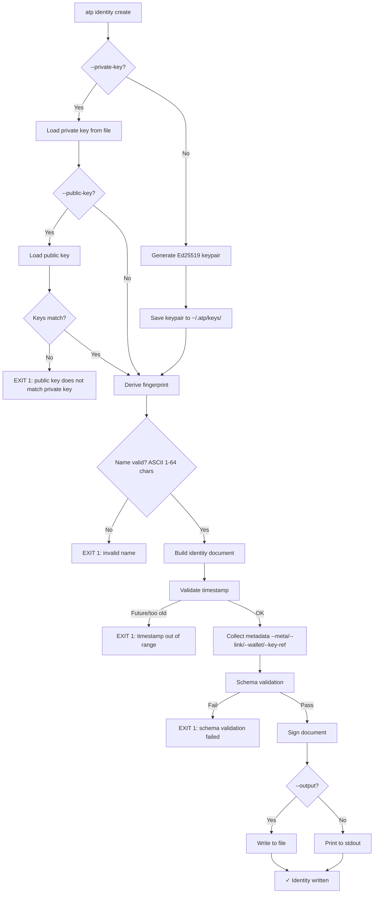

## identity show

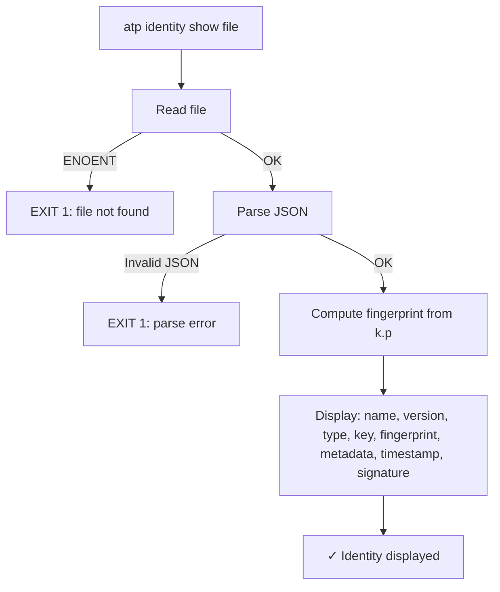

## identity inscribe

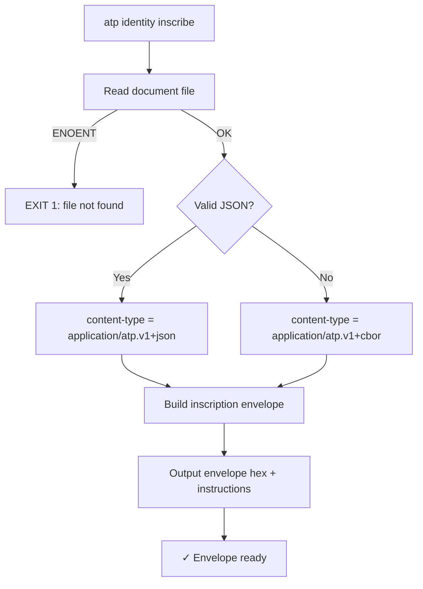

---

## attest

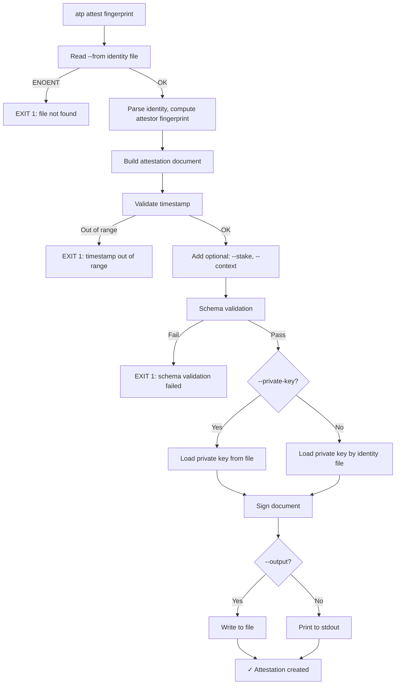

---

## att-revoke

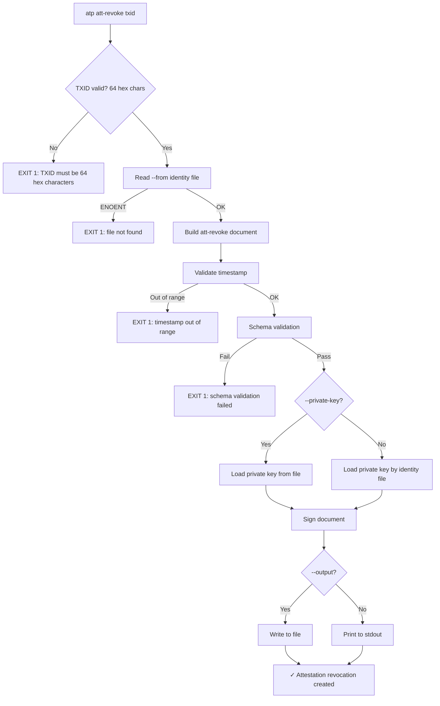

---

## heartbeat

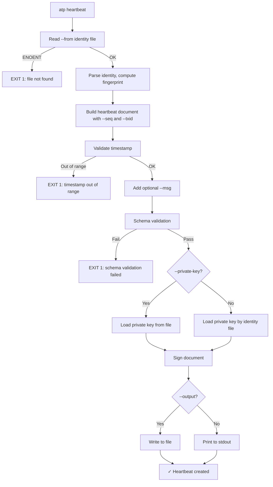

---

## supersede

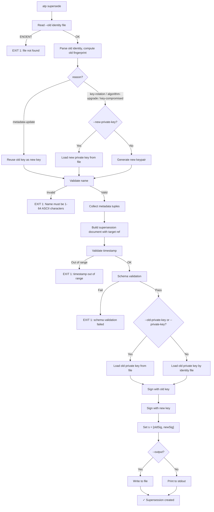

---

## revoke

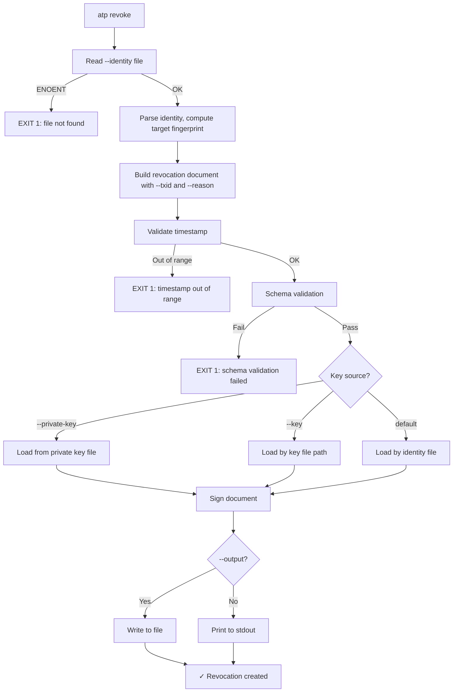

---

## receipt create

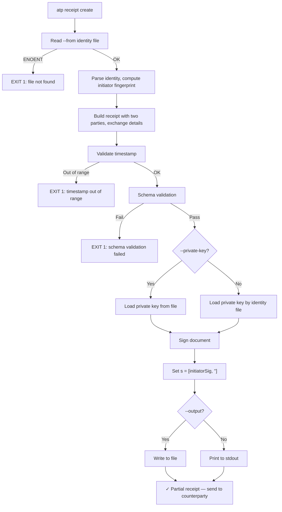

## receipt countersign

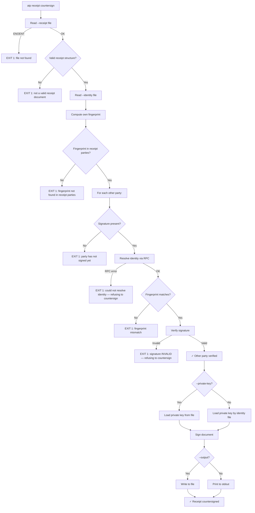

---

## verify

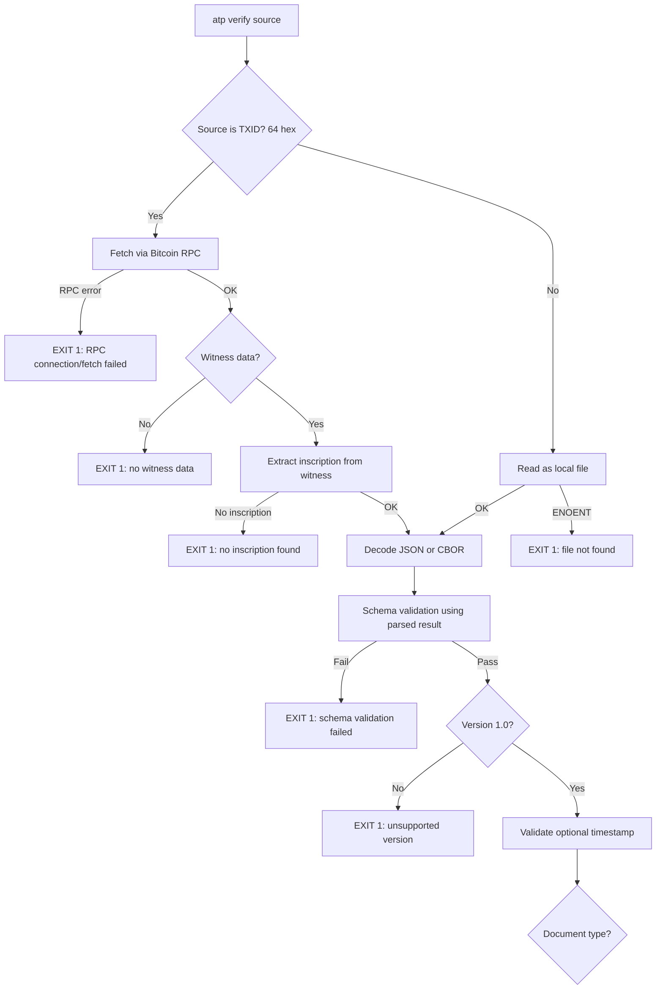

### verify — by document type

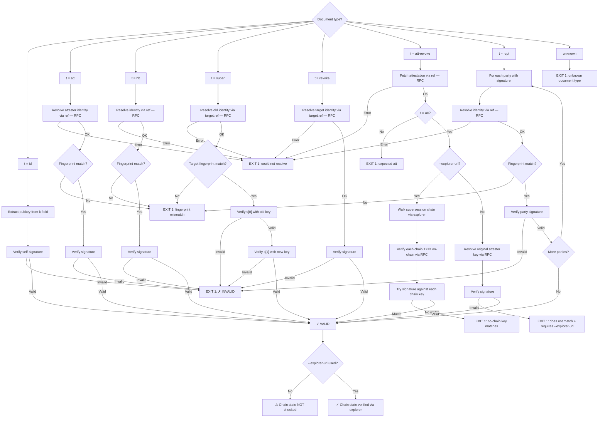

---

## key import

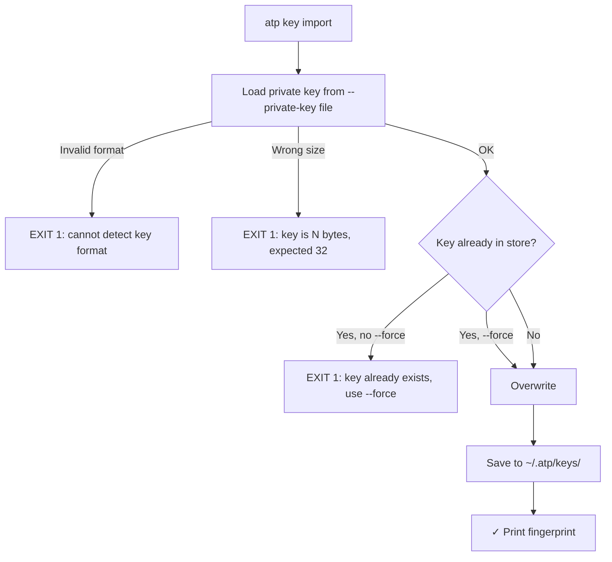

## key list

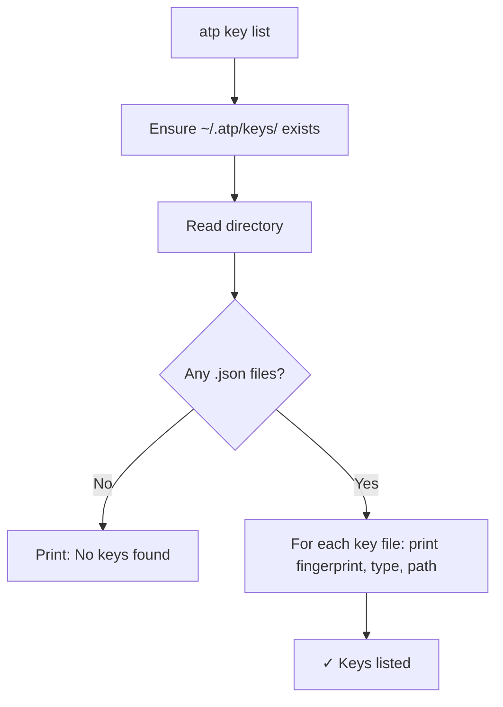

## key export

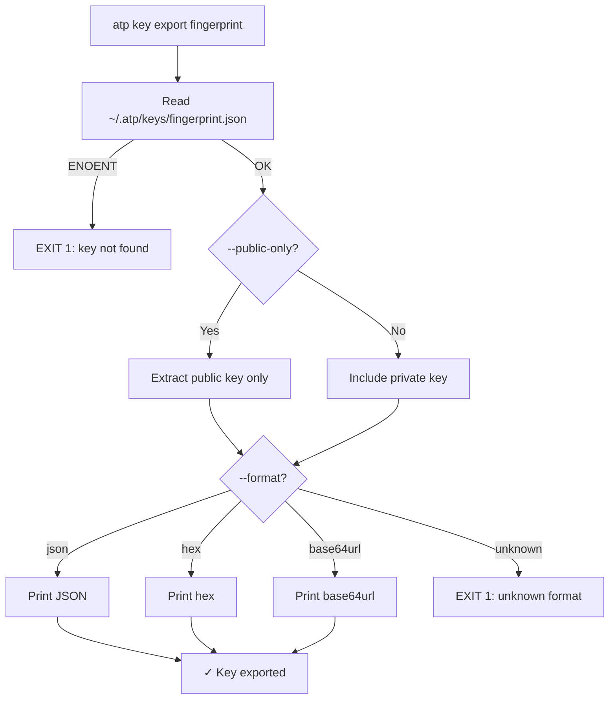

## key delete

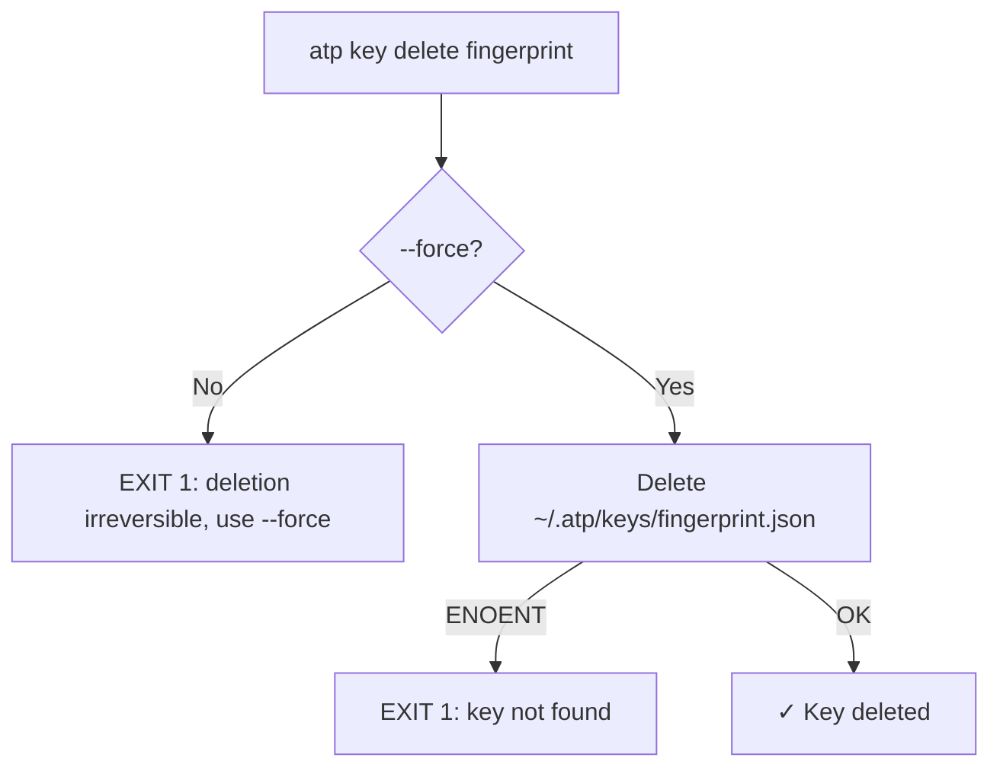

---

## Common Failure Modes

All commands share these failure patterns:

| Failure | Trigger | Exit Code |
|---------|---------|-----------|
| File not found | Any `--from`, `--identity`, `--file`, `--receipt` pointing to missing file | 1 |
| Invalid JSON | Corrupted or non-JSON identity file | 1 |
| Key load failure | Wrong format, wrong size, missing key file | 1 |
| Schema validation | Document doesn't match ATP schema (missing fields, wrong types) | 1 |
| Timestamp out of range | `ts` too far in the past or future | 1 |
| RPC connection failure | Bitcoin node unreachable or wrong credentials | 1 |
| Signature verification | Cryptographic signature doesn't match public key + document | 1 |
| TXID format | Non-hex or wrong length for transaction IDs | 1 |

**Principle:** All failures exit with code 1 and a descriptive error to stderr. No silent failures, no warnings-and-proceed. AI agents need unambiguous failure signals.
